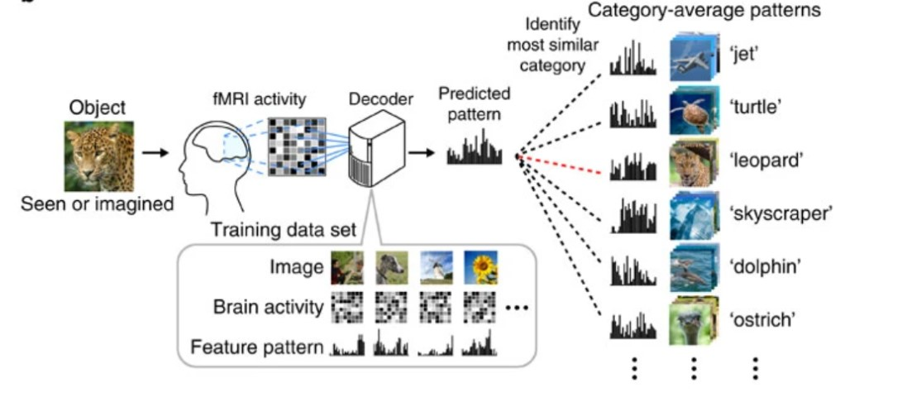
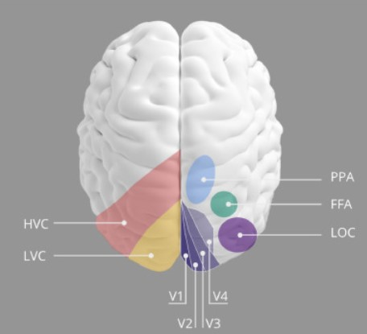
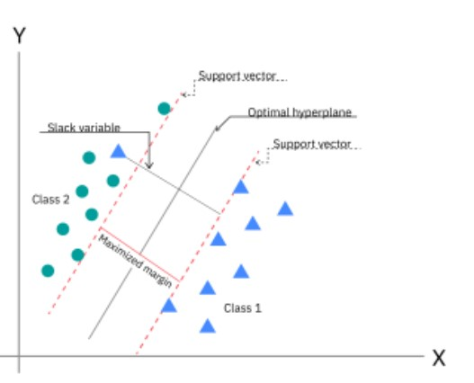
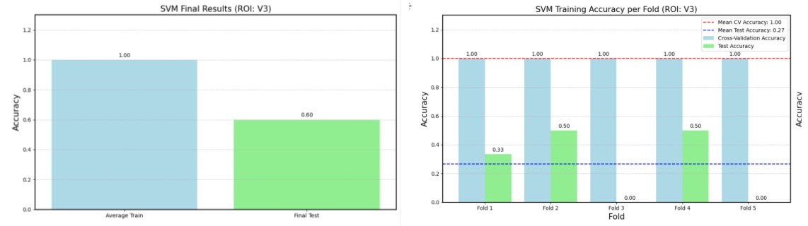
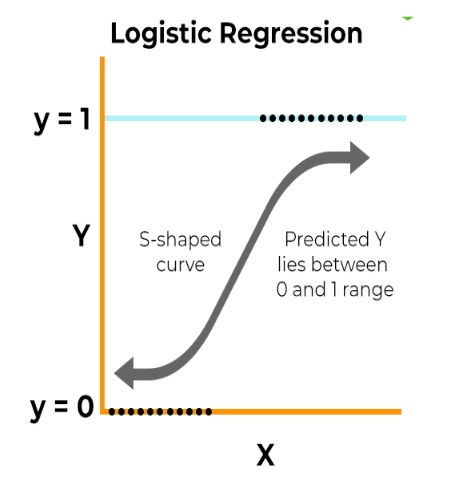
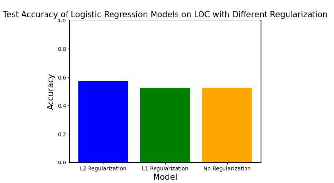
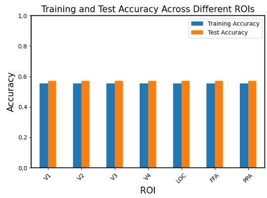
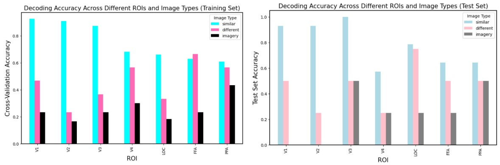

# AiN-2024

# fMRI Brain Decoding Project

A machine learning approach to decode visual stimuli from brain activity patterns using fMRI data.

## Team Members

- [Yasmin Gebril, Clinical Pharmacist](https://www.linkedin.com/in/yasmin-gebril-87a776230/)
- [Khitam Akel, Pursuing a Computational Neuroscience PhD](https://www.linkedin.com/in/khitam-aqel-bb238b105/)
- [Nada Salah, Computational Neuroscience Enthusiast](https://www.linkedin.com/in/nada-o-salah/)
- [Salma Waleed, AI and Robotics](https://www.linkedin.com/in/swaleed3/)
- Fatma Abd El Haseeb
- Sama Ehab, Our Aspiring High Schooler 🤩

## Project Overview

This project explores how the brain encodes sensory information by establishing relationships between visual stimuli and measured brain responses. We use machine learning techniques to decode brain activity patterns from different regions of interest (ROIs) in the visual cortex.

### Generic Object Decoding Framework

*Framework for decoding visual stimuli from brain activity patterns. The process involves training on fMRI data and predicting patterns for new stimuli.*

### Brain Regions and Visual Processing Hierarchy

Our analysis focuses on several key brain regions:

- V1-V3 (LVC): Processes basic visual features, edge detection, and spatial orientation
- V4 (MVC): Handles color discrimination and shape recognition
- Higher Visual Cortex (HVC):
  - LOC: Object form recognition and identification
  - FFA: Face detection and recognition
  - PPA: Scene and place recognition

## Implementation Details

### Reproducibility Standards

We maintain strict reproducibility standards:
- Numpy Random Generator Seed: 0
- Scikit Learn Random State: 7
- Test Ratio: 30%
- K-Fold: 5 folds (no stratifying, no shuffling)
- Cross-validation on training data for parameter tuning

### Machine Learning Models

#### Support Vector Machines (SVM)

SVMs followed these characteristics:
- Linear kernel
- Optimal hyperplane maximization
- Support vector identification for classification boundaries

#### SVM Results

Reflection on the results:
- Consistent cross-validation performance
- Clear distinction between training and test accuracies
- Effective classification across different ROIs

#### Logistic Regression

Key features:
- Binary output with probability predictions
- S-shaped activation curve
- Gradual transition between classes

#### Regularization Analysis

We compared different regularization techniques:
- L1 (Lasso)
- L2 (Ridge)
- No regularization
Results showed L2 regularization generally performed best in preventing overfitting.

## Model Performance Across ROIs

### Cross-Validation Results 

Detailed performance metrics across different brain regions showed consistent patterns of accuracy, with some variation between regions.

### Image Type Analysis

Our analysis revealed:
- Similar images: Highest decoding accuracy
- Different images: Moderate accuracy
- Imagery-induced activity: Lowest accuracy overall

### Limitations and Insights

While our results are promising, several limitations should be considered:

1. The binary classification approach, while effective, might not capture the full complexity of neural representations.

2. The current analysis focuses on individual ROIs, potentially missing important interactions between brain regions.

3. The lower performance on imagery tasks suggests we might need more sophisticated models or different approaches to capture these more subtle neural patterns.

These limitations, however, point to exciting directions for future research and potential improvements in brain decoding methodologies.

## Future Work

1. Neural Network Implementation

2. Extended Analysis
   - Wider image categories
   - Enhanced imagery task accuracy
   - Statistical validation methods

3. Group Level Analysis
   - Multiple subject studies
   - Cross-subject pattern analysis

## References

Horikawa, T., Kamitani, Y. Generic decoding of seen and imagined objects using hierarchical visual features. Nat Commun 8, 15037 (2017). https://doi.org/10.1038/ncomms15037
